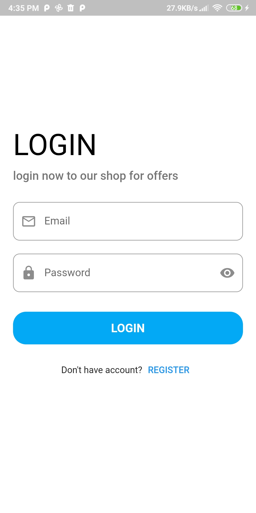
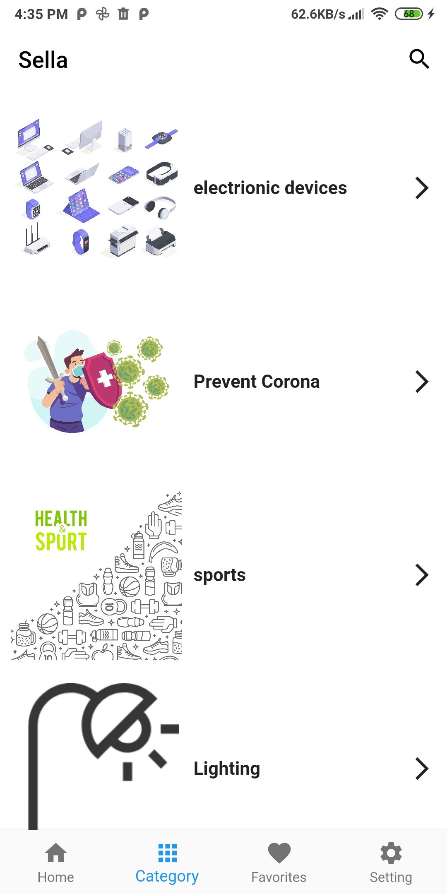

# shopapp

This is a  e-commerce application. I made by using api (postman), Shared Preference and State Management (Bloc)
## Tools
-api(postman)
- State management:
    - Bloc Design Pattern 

- Packages:
    - shared_preferences
    - conditional_builder_null_safety
    - flutter_bloc
    - bloc
    - carousel_slider
    -dio
   ## video
   https://user-images.githubusercontent.com/79115058/147083781-a42bfb25-d7d2-43e5-8c08-a8ec5f53e923.mp4
   
   ## Screenshots
   
   <table>
  <tr>
    <td></td>
    <td></td>
    <td></td>
      <td></td>
  </tr>
 </table>

<table>
  <tr>
    <td></td>
    <td></td>
    <td></td>
  </tr>
 </table>
    
  

